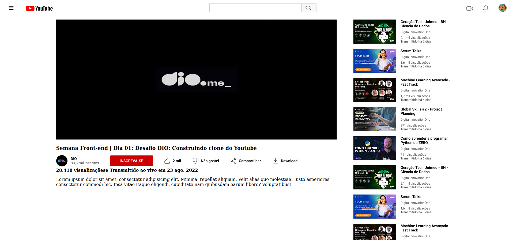

# Desafio de Projeto Bootcamp [DIO](https://web.dio.me)/Santander

Neste desafio de projeto, desenvolvido pela instrutora [Michele Ambrosio](https://github.com/micheleambrosio) o objetivo principal era recriar a tela principal do Youtube, colocando em prática os ensinamentos das aulas sobre FlexBox, o design foi construído pela instrutora utilizando o Figma. Abaixo uma captura de tela do resultado do projeto.

